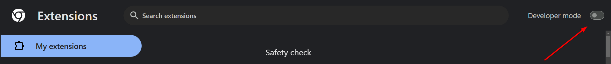
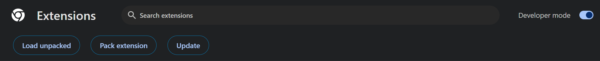

# Youtube Scroll Volume

This extension will let you change the volume of the youtube player by scrolling on it.

## Installation

### 1. Clone the repo

```sh
git clone github.com/emilyxfox/youtube-scroll-volume
```

### 2. Install dependencies with npm

```sh
npm install
```

### 3. Build extension

```
npm run build
```

### 4. Enable developer mode

Navigate to (chrome://extensions)[chrome://extensions] or your browsers equivilent.

In the top right click toenable developer mode. 

### 5. Import extension

Click the load unpacked button and select the `dist` directory.



### 6. Reload any open Youtube pages.

## Usage

You can now change the volume of any normal (non-short) youtube video by scrolling on the player.

You can change the volume step size for each scroll by clicking on the extension icon.

Your step value is stored in Chrome Synced Storage.
